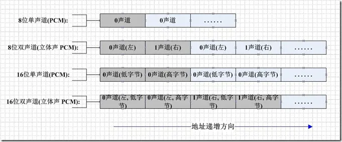
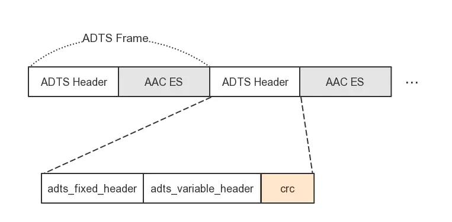
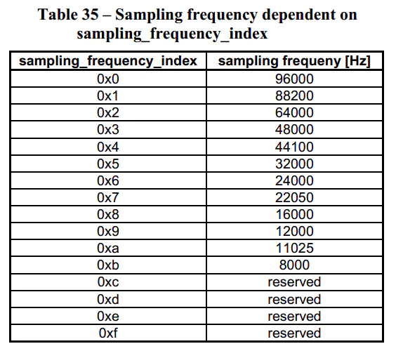

# 音频格式

主要是对音视频的基本知识进行记录学习.

- [音频格式](#音频格式)
  - [1 PCM(脉冲编码调制)](#1-pcm脉冲编码调制)
    - [1.1 说明](#11-说明)
  - [1.2 工作原理](#12-工作原理)
  - [1.3 PCM数据格式](#13-pcm数据格式)
    - [1.3.1 PCM数据的6个参数](#131-pcm数据的6个参数)
    - [1.3.2 FFmpeg中提供的样本格式](#132-ffmpeg中提供的样本格式)
    - [1.3.3 播放/分析PCM文件](#133-播放分析pcm文件)
    - [1.3.4 PCM音频数据格式](#134-pcm音频数据格式)
    - [1.3.5 FFmpeg支持的PCM数据格式](#135-ffmpeg支持的pcm数据格式)
    - [1.3.6 PCM音频的处理](#136-pcm音频的处理)
      - [1.3.6.1 分离双声道PCM音频数据左右声道的数据](#1361-分离双声道pcm音频数据左右声道的数据)
  - [2 AAC](#2-aac)
    - [2.1 说明](#21-说明)
      - [2.1.1 特点](#211-特点)
      - [2.1.2 特性](#212-特性)
    - [2.2 帧格式](#22-帧格式)

## 1 PCM(脉冲编码调制)

### 1.1 说明

数字信号是对连续变化的**模拟信号**进行抽样, 量化和编码产生的, 称为`PCM`(Pulse-code modulation), 即脉冲编码调制. 这种电的数字信号成为数字基带信号, 由`PCM`电端机产生. 数字传输系统都是采用脉码调制(Pulse-code modulation)体制.

脉码调制的音频格式被DVD-A所采用, 它支持立体声和5.1环绕声. <u>脉冲编码调制的位深度, 从14bit发展到16bit, 18bit, 20bit直到24bit; 采样频率从44.1kHz发展到192kHz.</u>

## 1.2 工作原理

脉冲编码调制就是把一个时间连续, 取值连续的模拟信号变换成时间离散, 取值离散的数字信号后在信道中传输. 脉冲编码调制就是对模拟信号先抽样, 再对样值幅度量化, 编码的过程.

**抽样**, 就是对模拟信号进行周期性扫描, 把时间上连续的信号编程时间上离散的信号, 抽样必须遵循奈奎斯特抽样定理. 该模拟信号经过抽样后, 还应当包含原信号中所有信息, 也就是说无失真的恢复原模拟信号. 它的抽样速率的下限是由抽样定理确定的. 抽样速率采用8KHZ.

**量化**, 就是把经过抽样得到的瞬时值将其幅度离散, 即用一组规定的电平, 把瞬时抽样值用最接近的电平值来表示, 通常是用二进制表示.

**量化误差**, 量化后的信号和抽样信号的差值. 量化误差在接收端表现为噪声, 称为量化噪声. <u>量化级数越多误差越小, 响应的二进制码位数越多, 要求传输速率越高, 频带越宽.</u> 为了使量化噪声尽可能小而所取的码位数又不太多, 通常采用**非均匀量化**的方法进行量化. 非均匀量化根据幅度的不同区间来确定量化间隔, 幅度小的区间量化间隔取的小, 幅度大的区间量化间隔取得大.

一个模拟信号经过抽样量化后, 得到已量化的脉冲幅度调制信号, 它仅为有限个数值.

**编码**, 就是用一组二进制码来表示每一个固定电平的量化值. 然而, 实际上量化是在编码过程中同时完成的, 故编码过程也成为模/数变换, 可记作A/D.

## 1.3 PCM数据格式

### 1.3.1 PCM数据的6个参数

1. `Sample Rate`: 采样率. 8kHz(电话), 44.1kHz(CD), 48kHz(DVD).
2. `Sample Size`: 量化位数. 通常为16bit.
3. `Number of Channels(Channel Layout)`: 通道个数. 常见的音频有立体声(Stereo)和单声道(Mono)两种类型, 立体声包含左声道和右声道. 另外, 还有环绕立体声等其它不太常用的类型.
4. `Sign`: 表示样本数据是否是有符号位.
5. `Byte Ordering`: 字节序. 字节序是`little-endian`(小端)还是`big-endian`(大端)
6. Integer Or Floating Point: 整形或者浮点型. 大多数数据格式的PCM样本数据使用整形表示, 而在一些对精度要求高的应用方面, 使用浮点类型标识PCM样本数据.

### 1.3.2 FFmpeg中提供的样本格式

| 序号 | 枚举                 | 值  | 描述                           |
| ---- | -------------------- | --- | ------------------------------ |
| 1    | `AV_SAMPLE_FMT_NONE` | -1  | 无                             |
| 2    | `AV_SAMPLE_FMT_U8`   |     | 单个采样点的为8位无符号整型    |
| 3    | `AV_SAMPLE_FMT_S16`  |     | 单个采样点的为16位整型         |
| 4    | `AV_SAMPLE_FMT_S32`  |     | 单个采样点的为32位整型         |
| 5    | `AV_SAMPLE_FMT_FLT`  |     | 单个采样点的为32位浮点数       |
| 6    | `AV_SAMPLE_FMT_DBL`  |     | 单个采样点的为64位双精度浮点数 |
| 7    | `AV_SAMPLE_FMT_U8P`  |     | 单个采样点的为8位无符号整型    |
| 8    | `AV_SAMPLE_FMT_S16P` |     | 单个采样点的为16位整型         |
| 9    | `AV_SAMPLE_FMT_S32P` |     | 单个采样点的为32位整型         |
| 10   | `AV_SAMPLE_FMT_FLTP` |     | 单个采样点的为32位浮点         |
| 11   | `AV_SAMPLE_FMT_DBLP` |     | 单个采样点的为64位浮点         |
| 12   | `AV_SAMPLE_FMT_S64`  |     | 单个采样点的为64位整型         |
| 13   | `AV_SAMPLE_FMT_S64P` |     | 单个采样点的为64位整型         |
| 14   | `AV_SAMPLE_FMT_NB`   |     |                                |

**带P和不带P, 关系到了`AVFrame`中的数据排列, 不带P则是`LRLRLRLRLR`, 带P则是`LLLLLRRRRR`排列, 若是双通道带P则意味着, `data[0]`全是L, `data[1]`全是R(注意: 这是采样点, 不是字节), PCM播放器播放的文件需要的是`LRLRLRLRLR`的.**

### 1.3.3 播放/分析PCM文件

- `FFmpeg`工具包中的`ffplay`:

  ```bash
  // 样本格式为f32le, 单声道, 采样率为48000Hz的Pcm音频文件
  ffplay -f f32le -ac 1 -ar 48000 pcm_audio.pcm
  ```

  有的同学可能会疑惑f32le是什么? 这是ffmpeg支持的数据格式的一种, 只不过在调用api时木有, 使用`Terminal`的时候是可以传入的.

  `f32le`代表的就是`32-bit float-point little-endian`(32位浮点型 小端), 具体跳转至[1.3.5小节](#135-ffmpeg支持的pcm数据格式)

- Audacity: 一款免费开源的跨平台音频处理软件, 非常好用!

### 1.3.4 PCM音频数据格式

如果是单声道的音频文件, 采样数据按时间的先后顺序依次存入(有时候也会采用`LRLRLRLR`方式存储, 只是了另一个声道的数据为0), 如果是双声道的花就按照`LRLRLRLR`的方式存储, 存储的时候与字节序有关. big-endian模式如下:

<div align=center>
    
</div>

### 1.3.5 FFmpeg支持的PCM数据格式

使用`ffmpeg -formats`命令, 即可获取ffmpeg支持的音视频格式, 其中我们可以找到支持PCM的格式.

```text
 DE alaw            PCM A-law
 DE f32be           PCM 32-bit floating-point big-endian
 DE f32le           PCM 32-bit floating-point little-endian
 DE f64be           PCM 64-bit floating-point big-endian
 DE f64le           PCM 64-bit floating-point little-endian
 DE mulaw           PCM mu-law
 DE s16be           PCM signed 16-bit big-endian
 DE s16le           PCM signed 16-bit little-endian
 DE s24be           PCM signed 24-bit big-endian
 DE s24le           PCM signed 24-bit little-endian
 DE s32be           PCM signed 32-bit big-endian
 DE s32le           PCM signed 32-bit little-endian
 DE s8              PCM signed 8-bit
 DE u16be           PCM unsigned 16-bit big-endian
 DE u16le           PCM unsigned 16-bit little-endian
 DE u24be           PCM unsigned 24-bit big-endian
 DE u24le           PCM unsigned 24-bit little-endian
 DE u32be           PCM unsigned 32-bit big-endian
 DE u32le           PCM unsigned 32-bit little-endian
 DE u8              PCM unsigned 8-bit
 DE vidc            PCM Archimedes VIDC
```

> - s代表是有符号, u是无符号, f是浮点数
> - le是小端, be是大端

### 1.3.6 PCM音频的处理

#### 1.3.6.1 分离双声道PCM音频数据左右声道的数据

按照声道的`LRLRLRLR`的PCM音频数据可以通过将他们交叉的读出来的方式来分离左右声道的数据.

```cpp
/**
 * 分离左右声道的数据
 * */
void f32le_convert_to_fltp(float *f32le, float *fltp, int nb_samples) {
    float *fltp_l = fltp;   // 左通道
    float *fltp_r = fltp + nb_samples;   // 右通道
    for(int i = 0; i < nb_samples; i++) {
        fltp_l[i] = f32le[i*2];     // 0 1   - 2 3
        fltp_r[i] = f32le[i*2+1];   // 可以尝试注释左声道或者右声道听听声音
    }
}
```

## 2 AAC

### 2.1 说明

`AAC`(Advanced Aydui Coding), 即高级音频编码. 基于`MPEG-2`的音频编码技术.

`AAC`是一种专为声音数据设计的文件压缩格式, 与`MP3`不同, 它采用了全新的算法进行编码, 更加高效, 具有更高的"性价比", 利用`AAC`格式, 可使人感觉声音质量没有明显降低的前提下, 更加小巧.

**优点:** 相较于`MP3`, `AAC`格式的音质更佳, 文件更小.

**不足:** `AAC`属于<u>有损压缩</u>的格式, 与无损格式相比音质存在"本质上"的差距.

#### 2.1.1 特点

1. 提升的压缩率: 可以以更小的文件大小获得更高的音质.
2. 支持多声道: 可提供最多48个全音域声道.
3. 更高的解析度: 最高支持96KHz的采样频率.
4. 提升的解码效率: 解码播放所占的资源更少.

#### 2.1.2 特性

**与`MP3`的关键不同**

`AAC`是在`MP3`基础上开发出来的, 所以两者的编码系统有一些相同之处. 但是对比一下两者的编码流程图, 会发现`AAC`的编码工序更加复杂.

1. 滤波器组(Filter bank): 主要完成信号的时频转换. 从而得到频域的频谱系数.
2. 时域噪音修整(Temporal Noise Shaping, TNS): 这项神奇的技术可以通过在频率域上的预测, 来修整时域上的量化噪声分布, 在一些特殊的语音和剧烈变化信号的量化上, TNS技术对音质的提高贡献巨大.
3. 预测(Prediction): 对音频信号进行预测可以减少重复冗余信号的处理, 提高效率.
4. 量化(Quantization): `AAC`的量化过程是使用两个巢状循环进行反复运算, 通过对比量化分析的良好控制, 比特率能够被更高效的利用.
5. 比特流格式(Bit-strem format): 在`AAC`中, 信息的传输都要经过熵编码, 以保证冗余尽可能少. 此外`AAC`拥有一个弹性的比特流结构, 使得编码效率进一步提高.
6. 长时期预测(Long Term Prediction, LTP): 这是一个`MPEG-4 AAC`中才有的工具, 它用来减少两个连续编码之间的信号冗余, 对于处理低码率的语音非常有效.
7. 知觉噪音代替(Perceptual Noise Substitution, PNS): 这也是`MPEG-4 AAC`中才有的工具, 当编码器发现类似噪音的信号时, 并不对其进行量化, 而是作个标记就忽略过去, 当解码时, 再还原出来, 这样就提高了效率.

### 2.2 帧格式

`AAC`音频格式有:

- `ADIF`(Audio Data Interchage format), 音频数据交换格式：只有一个统一的头，必须得到所有数据后解码，适用于本地文件.
- `ADTS`(Audio Data Transport Stream), 音视数据传输流：每一帧都有头信息，任意帧解码，适用于传输流.

下面主要介绍`ADTS`.

`ADTS`的组成单元是`ADTS Frame`.

<div align=center>
    
    <h6>ADTS帧格式</h6>
</div>

- `ADTS Frame`由`ADTS Header`和`AAC ES`组成.
- `ADTS Header`包含采样率, 声道数, 帧长度的信息.
- `ADTS`头信息的长度是7个字节或9个字节(由CRC的情况)

`ADTS Header`包含采样率, 声道数, 帧长度的信息.

- `adts_fixed_header`: 每一帧的内容时不变的.
- `adts_variable_header`: 每一帧的内容是存在变化的.
- `crc`: 16bits, `protection_absenet`字段为0时存在

`adts_fixed_header`:

| 字段                       | 比特数 | 说明                                                    |
| -------------------------- | ------ | ------------------------------------------------------- |
| `syncword`                 | 12     | 所有位必须为1, 即0xFFF                                  |
| `ID`                       | 1      | 0代表`MPEG-4`, 1代表`MPEG-2`                            |
| `layer`                    | 2      | 所有位必须为0                                           |
| `protection_absent`        | 1      | 1代表没有`crc`, 0代表有                                 |
| `profile`                  | 2      | 配置级别                                                |
| `sampling_frequency_index` | 4      | 标识使用的采样率(见下表35)                              |
| `private_bit`              | 1      | see ISO/IEC 11172-3, subclause 2.4.2.3 (Table 8)        |
| `channel_configuration`    | 3      | 取值为0时, 通过`inband`的PCE设置`channel_configuration` |
| `original/copy`            | 1      | 编码时设置为0, 解码时忽略                               |
| `home`                     | 1      | 编码时设置为0, 解码时忽略                               |

在`MPEG-2` `AAC`中定义了3种`profile`:

* MPEG-2 AAC Main
* MEPG-2 AAC LC(Low Complexity)
* MPEG-2 AAC SSR(Scalable Sampling Rate)

在`MPEG-4` `AAC`中定义了6种`profile`:

* MPEG-4 AAC Main
* MPEG-4 AAC LC (Low Complexity)
* MPEG-4 AAC SSR (Scalable Sample Rate)
* MPEG-4 AAC LTP (Long Term Predicition)
* MPEG-4 AAC LD (Low Delay)
* MPEG-4 AAC HE (High Efficiency) AACPlusV1/V2(3GPP)

<div align=center>
    
    <h6>表35</h6>
</div>